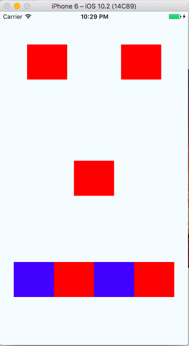

#### [Table of Contents](./../readme.md) | [Next ⇒](./)

# React Native Setup And Styling

### Objectives

By the end of this chapter, you should be able to:

- Describe the differences between react native and other mobile platforms
- Use flexbox properties to style a react-native app
- Explore the react native developer tools
- Add a dependency that has native components

### React Native Background

The react ecosystem is described as a learn once write anyone framework.  In other words, code may be slightly different on different platforms (web vs iOS vs android), but the fundamental ways that you build a react app are the same.  And hopefully many components that you create can be shared across the platforms.

This philosophy is in contrast to other frameworks like [apache cordova](https://cordova.apache.org/) that have tried to be a _write_ once and run anywhere framework.

The main difference between the two approaches is that react native apps actually compile down to native code.  In other words, the react native app that you create is very similar to implementing a native application on iOS or android.  In cordova however, most of your code is run in a web view inside of a native container, so fundamentally, you are trying to make a webpage look like a mobile app.

### Getting Setup


To get started, make sure you have `watchman`:

```
brew install watchman
```

And install the react native cli:

```sh
npm install -g react-native-cli
```

To create an iOS app, you will need XCode installed. And to create an android app, you'll need android studio.  You can find more info about setup for each platform in the [facebook setup docs](https://facebook.github.io/react-native/docs/getting-started.html)

### First App

To make your first app, in the terminal, type:

```
react-native init FirstApp
```

The cli will create a directory called FirstApp. Inside of it, you will get the following files:


* __package.json__: Lists our javascript dependencies.  This is what gets edited when you do `npm install --save <module_name>`
* __index.ios.js__: The entry point to our ios app.  We can put ios specific setup here.
* __index.android.js__: The entry point to our android app.  Android specific setup can go here
* __.babelrc__: The config file for babel (a transpiling library)
* __.flowconfig__: Flow is a static type checker than you can use in your app.  Find out more from [facebook](https://flowtype.org/)
* __node_modules__: A directory that contains all of our JS dependencies.
* __ios__: A directory that contains build settings for iOS. The xcode project will be found here.
* __android__: A directory that contains build settings for android. The gradle build scrips will be in here.

To run your app for the first time in the simulator, run:

```
react-native run-ios
```

You should see a welcome screen that tells you a little about react native.

### New Components In React Native

Since react native is not web development, our jsx will not have access to the `react-dom`.  If you open up `index.ios.js`, you'll notice new imports from `react-native`:

* __AppRegistery__: Used to register the parent component for our app.  We will only need to use this in the entry point for our app.
* __StyleSheet__: Useful for creating stylesheet objects.  Checks to make sure the values that are being passed are valid react styles.
* __View__: A container component.  You can think of it as a similar component to an html div
* __Text__: For showing text. Unlike the browser, our text must always be inside of a text component.


### React Native Styling

Many of the styles that you use in react native are very similar to what you'll use on the web.

For example, the following (hopefully familiar) styles exist in react native:

* height
* width
* backgroundColor
* margin
* padding
* fontSize
* fontWeight
* color

To add a style to a component, you can do a few things. Commonly, you'll import `StyleSheet` from `react-native` and use `StyleSheet.create` which accepts an object of styles.  Here is an example that gives text some styling:

```
import React, { Component } from 'react';
import {
  AppRegistry,
  StyleSheet,
  Text,
  View
} from 'react-native';

export default class FirstApp extends Component {
  render() {
    return (
      <View>
        <Text style={styles.text}>
          Welcome to React Native!
        </Text>
      </View>
    );
  }
}

const styles = StyleSheet.create({
  text: {
    color: '#ff0000',
    fontWeight: 'bold',
    fontSize: 50,
  },
});

AppRegistry.registerComponent('FirstApp', () => FirstApp);

```

Notice that the text takes a style prop, that accepts a JavaScript object from `StyleSheet.create`.  We can also just put our styles inline:

```
import React, { Component } from 'react';
import {
  AppRegistry,
  StyleSheet,
  Text,
  View
} from 'react-native';

export default class FirstApp extends Component {
  render() {
    return (
      <View>
        <Text style={{
           color: '#ff0000',
           fontWeight: 'bold',
           fontSize: 50,
        }}>
          Welcome to React Native!
        </Text>
      </View>
    );
  }
}

AppRegistry.registerComponent('FirstApp', () => FirstApp);
```

We don't need to use `StyleSheet.create in this case because we are providing the style object directly to the Text component.  It is a good idea to use `StyleSheet.create` though because it checks to make sure the styles you provided in your objects are all valid react native styles.

One more thing you can do with styling is provide an array.  Say you'd like to override one style:


```
import React, { Component } from 'react';
import {
  AppRegistry,
  StyleSheet,
  Text,
  View
} from 'react-native';

export default class FirstApp extends Component {
  render() {
    return (
      <View>
        <Text style={[styles.text, {fontSize: 35}]}>
          Welcome to React Native!
        </Text>
      </View>
    );
  }
}

const styles = StyleSheet.create({
  text: {
    color: '#ff0000',
    fontWeight: 'bold',
    fontSize: 50,
  },
});

AppRegistry.registerComponent('FirstApp', () => FirstApp);

```

Since `fontSize: 35` is later in the array, it will overwrite the first style.

### Flexbox Styling


React native has embraced flexbox for its styling. In order to use flexbox, it's important to understand a few concepts:

#### flexDirection

Determines the primary axis for the flexbox flow.  By default the `flexDirection` is set to `column`, which means that elements on the page stack vertically  in the view.  The other option is `row`, which means that the elements are positioned next to each other in a row.

Try the following example and switch the flexDirection between row and column:

```
import React, { Component } from 'react';
import {
  AppRegistry,
  StyleSheet,
  Text,
  View
} from 'react-native';

export default class FirstApp extends Component {
  render() {
    return (
      <View style={styles.container}>
        <View style={styles.box} />
        <View style={styles.box} />
        <View style={styles.box} />
        <View style={styles.box} />
      </View>
    );
  }
}

const styles = StyleSheet.create({
  container: {
    flex: 1,
    justifyContent: 'space-around',
    alignItems: 'center',
    backgroundColor: '#F5FCFF',
    flexDirection: 'column'
  },
  boxR: {
    width: 70,
    height: 70,
    backgroundColor: 'red'
  }
});
```

#### justifyContent

Acts on the primary axis in the flexbox flow.  So if the primary direction is `flexDirection: 'column'` and content is `justifyContent: center` all of the items will be be bunched together in the center in the available vertical space.

However, if the flexDirection is `flexDirection: 'row'` and the content is `justifyContent: center`, all of the content will be bunched together in the center of the horizontal space

You can read all of the properties for `justifyContent` in the [MDN docs](https://developer.mozilla.org/en-US/docs/Web/CSS/justify-content)

#### alignItems

Acts on the secondary axis in the flexbox flow.  So if the flexDirection is ``flexDirection: 'column'`, `alignItems` will align horizontally, and if the flexDirection is `flexDirection: 'row'`, `alignItems` will align vertically.

You can check out the [MDN docs](https://developer.mozilla.org/en-US/docs/Web/CSS/align-items) for align items as well.

#### width and height

React native styling also supports width and height.  As of [February 2017](https://github.com/facebook/react-native/releases/tag/v0.42.0), react native supports percentages for widths and heights!  So you can now do something like this:

```
conatinerRow: {
    width: '100%',
    height: 100
}
```

#### flex

This property accepts a number and determines the proportion of the available space to occupy.  For example, if there are two elements, both with a value of `flex: 1`, the two elements will both be given have the space.  The value of flex doesn't exactly matter, just the proportion.  So the same behavior would happen if both elements have `flex: 0.5`.  You can read more about flex in [react native docs](https://facebook.github.io/react-native/docs/layout-props.html#flex)

#### flexbox

To get more practice with flexbox, try [flexbox froggy](http://flexboxfroggy.com/).  Not all of the styles on the site apply to react native (the reverse options don't exist for example), but much of them apply.


### Developer Tools In React Native

To get the developer menu to pop up while using the iOS simulator, type command + D or go to Hardware menu and select shake gesture.  If you are debugging on the physical phone, you can simply shake the phone.

There are some really cool features here:

* Reload - simply reload the app along with any changes
* Debug JS Remotely - use chrome dev tools to set break points, inspect state, and look at the console logs!
* Enable Live Reload - Automatically reloads your new bundle whenever you make a change.  Speeds up development a lot!
* Start Systrace - used for performance
* Enable Hot Reloading -  this feature tries to reload your code changes without making a new app bundle.  It does this without changing your state, but sometimes it will get confused. I prefer to use this mainly for styling.
* Show Inspector - Similar to the inspector on chrome.  You can see elements, their margin, padding, etc.
* Show Perf Monitor - Shows perf stats like frame rate, etc.

__EXERCISE 1__

Make the following UI:




### Native Dependencies

React native uses npm to manage dependencies, but sometimes those dependencies have native code that must be linked into the iOS build or the android build.  Thankfully for most projects, the process is as simple as doing the following:

```
react-native link
```

For example, let's install `react-native-vector-icons`:

```
npm install --save react-native-vector-icons
```

Next, run:

```
react-native link
```

Now you should have access to that module in your code.

__EXERCISE 2__

Try adding an icon to your app! You can see an icon example in the [react native vector icon docs](https://github.com/oblador/react-native-vector-icons)


__EXERCISE 3__

Create the following mock up in react native


### Exercise Solutions

__EXERCISE 1__

```
import React, { Component } from 'react';
import {
  AppRegistry,
  StyleSheet,
  Text,
  View
} from 'react-native';

export default class FirstApp extends Component {
  render() {
    return (
      <View style={styles.container}>
        <View style={[
            styles.containerRow,
            {justifyContent: 'space-around'}
          ]} >
          <View style={styles.boxR} />
          <View style={styles.boxR} />
        </View>
        <View style={styles.boxR} />
        <View style={styles.containerRow} >
          <View style={styles.boxB} />
          <View style={styles.boxR} />
          <View style={styles.boxB} />
          <View style={styles.boxR} />
        </View>
      </View>
    );
  }
}

const styles = StyleSheet.create({
  container: {
    flex: 1,
    justifyContent: 'space-around',
    alignItems: 'center',
    backgroundColor: '#F5FCFF',
    flexDirection: 'column'
  },
  containerRow: {
    width: '100%',
    height: 100,
    justifyContent: 'center',
    flexDirection: 'row' 
  },
  boxR: {
    width: 80,
    height: 70,
    backgroundColor: 'red'
  },
  boxB: {
    width: 80,
    height: 70,
    backgroundColor: 'blue'
  },
});

AppRegistry.registerComponent('FirstApp', () => FirstApp);
```

#### [Table of Contents](./../readme.md) | [Next ⇒](./)
